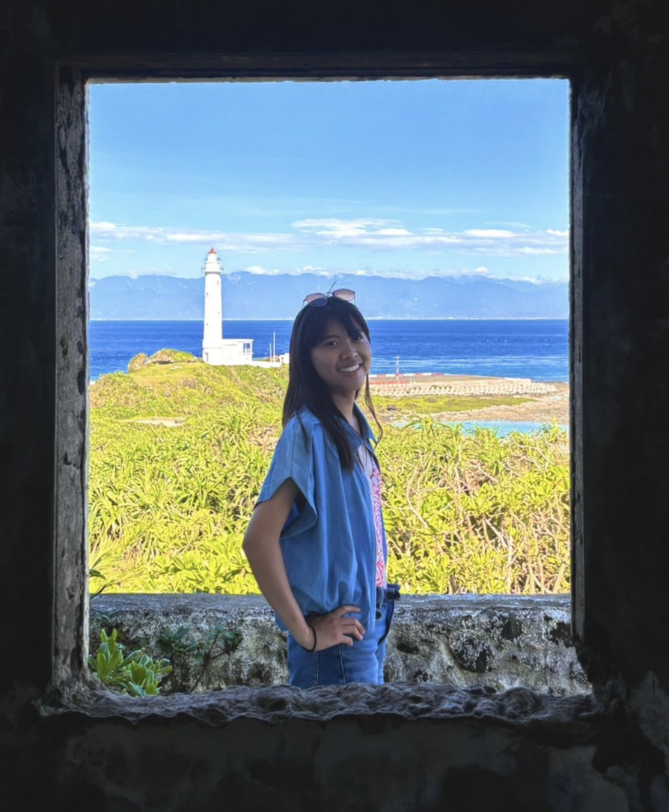

# Introduction

Hello. I'm Rachel Hsieh, a summer intern at Academia Sinica’s Center for RCHSS in 2025. I'm currently a rising junior majoring in anthropology at UCLA, with particular interests in archaeology, history, and literature. I also enjoy National Geographic and Agatha Christie novels.

Lately, I’ve been exploring how technologies like GIS can support archaeological research. After connecting with professionals working on Taiwanese archaeology, I became interested in how the Paiwan’s usage of spaces and the Japanese’s forced relocation policies impacted their lives. This topic allows me to combine both anthropological and geospatial approaches, an opportunity I found both challenging and rewarding during my time here.

